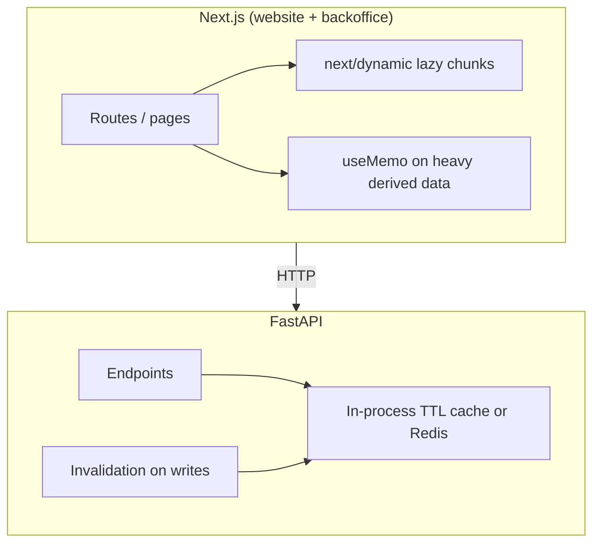

# Application Caching — Reference Solution

## Purpose

Reference for a complete submission inside the **company monorepo** (`ai-engineering-company-project-monorepo`): deliberate frontend caching (lazy loading + `useMemo`), backend caching with TTL and invalidation on at least two FastAPI endpoints, and a structured `CACHING_REPORT.md` that documents tradeoffs (freshness vs. performance) and what was intentionally not cached.

## Architecture (caching layers)



| Layer    | Technique                        | When to use                                      |
| -------- | -------------------------------- | ------------------------------------------------ |
| Frontend | `next/dynamic` / `React.lazy`    | Heavy below-fold or flow-specific UI             |
| Frontend | `useMemo`                        | Non-trivial derived values with stable deps      |
| Backend  | Dict + TTL / `lru_cache` / Redis | Expensive read, stable data, high call frequency |
| Backend  | Key scoped per user              | Any personalised or session-specific response    |

## Required deliverable: `CACHING_REPORT.md`

Indicative outline (repo root or `docs/`):

```markdown
# Caching report

## Frontend decisions

| Target              | Technique    | Justification                         |
| ------------------- | ------------ | ------------------------------------- |
| Analytics dashboard | next/dynamic | Large chart lib; not on initial path  |
| Settings panel      | next/dynamic | Rarely opened; reduces TTI on home    |
| Order stats table   | useMemo      | Filters/sorts 1k+ rows on each render |

## Backend decisions

| Endpoint             | Cost est.   | Call freq. | TTL | Invalidation             |
| -------------------- | ----------- | ---------- | --- | ------------------------ |
| GET /catalog         | ~120ms DB   | High       | 60s | POST/PATCH /catalog/\*   |
| GET /metrics/summary | Aggregation | High       | 30s | Webhook or admin refresh |

## Tradeoffs acknowledged

Product listing TTL 60s: stale prices acceptable for browse; checkout re-fetches live price.

## What was not cached (and why)

GET /me/profile — per-user; shared key would leak data.
GET /orders/{id} — changes on every status update; TTL would confuse UX.
```

## Frontend examples

### Lazy load (backoffice analytics)

```tsx
// uis/backoffice/app/dashboard/page.tsx
import dynamic from "next/dynamic";

const AnalyticsCharts = dynamic(() => import("@/components/AnalyticsCharts"), {
  loading: () => <p>Loading charts…</p>,
  ssr: false,
});

export default function DashboardPage() {
  return (
    <main>
      <h1>Dashboard</h1>
      <AnalyticsCharts />
    </main>
  );
}
```

Document **two** distinct components or routes (e.g. website marketing block + backoffice settings).

### useMemo (filtered aggregates)

```tsx
import { useMemo } from "react";

function OrderStatsTable({ orders, statusFilter }: Props) {
  const filtered = useMemo(
    () =>
      orders
        .filter((o) => o.status === statusFilter)
        .sort((a, b) => b.total - a.total),
    [orders, statusFilter],
  );

  return <Table rows={filtered} />;
}
```

Do **not** memoize trivial string joins or one-liners.

## Backend examples

### In-process TTL cache + invalidation

```python
# app/core/cache.py
import time
from typing import Any

_store: dict[str, tuple[float, Any]] = {}


def cache_get(key: str) -> Any | None:
    entry = _store.get(key)
    if not entry:
        return None
    expires_at, value = entry
    if time.time() > expires_at:
        del _store[key]
        return None
    return value


def cache_set(key: str, value: Any, ttl_seconds: int) -> None:
    _store[key] = (time.time() + ttl_seconds, value)


def cache_invalidate_prefix(prefix: str) -> None:
    for key in list(_store):
        if key.startswith(prefix):
            del _store[key]
```

```python
# app/routes/catalog.py
from fastapi import APIRouter
from app.core.cache import cache_get, cache_set, cache_invalidate_prefix

router = APIRouter()
CACHE_KEY = "catalog:list"
TTL = 60


@router.get("/catalog")
async def list_catalog():
    cached = cache_get(CACHE_KEY)
    if cached is not None:
        return cached
    data = await fetch_catalog_from_db()  # expensive
    cache_set(CACHE_KEY, data, TTL)
    return data


@router.post("/catalog/items")
async def create_item(payload: ItemCreate):
    item = await persist_item(payload)
    cache_invalidate_prefix("catalog:")
    return item
```

### User-scoped cache key (when endpoint is per-user)

```python
def cache_key_for_user(user_id: str, resource: str) -> str:
    return f"user:{user_id}:{resource}"
```

Never use a global key like `dashboard:summary` for responses that include user-specific fields unless the payload is identical for all users.

## Security checklist

- [ ] No session/JWT/profile data under shared keys
- [ ] TTL on every cached entry
- [ ] Invalidation (or prefix purge) on writes that affect cached reads
- [ ] At least one endpoint/component documented as **rejected** for caching with reason

## Validation notes

- Hit cached GET twice: second response faster (log timestamps or use `/docs`).
- After POST/PATCH/DELETE on related resource, next GET reflects new data.
- `CACHING_REPORT.md` names specific components/endpoints from **your** monorepo, not generic placeholders.
- PR branch `feature/caching-optimisation` → `main` on student monorepo per README.
