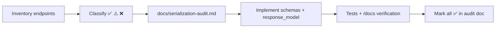

# Backend Serialization Audit — Reference Solution

## Purpose

Reference for a complete submission inside the **company monorepo** FastAPI app: every route has explicit Pydantic contracts, `docs/serialization-audit.md` records before/after state, and no endpoint returns raw ORM objects or untyped dicts.

## Audit loop (expected workflow)



| Phase          | Artifact                                        | Location                          |
| -------------- | ----------------------------------------------- | --------------------------------- |
| Discovery      | Route table (method, path, purpose)             | `docs/serialization-audit.md`     |
| Classification | Per-endpoint status + required output shape     | Same file                         |
| Implementation | `schemas/`, route `response_model`, body models | `apps/<backend>/` (monorepo path) |
| Verification   | Test suite green; manual `/docs` checks         | CI + interactive docs             |

Work on branch `feature/serialization-audit`; PR title `feat: serialization audit and implementation`.

## Required deliverable structure

### `docs/serialization-audit.md` (indicative outline)

```markdown
# Serialization audit

## Endpoint inventory

| Method | Path            | Purpose            | Before | After |
| ------ | --------------- | ------------------ | ------ | ----- |
| GET    | /api/users      | List users (admin) | ❌     | ✅    |
| GET    | /api/users/{id} | User profile       | ⚠️     | ✅    |
| POST   | /api/users      | Create user        | ❌     | ✅    |

Legend: ✅ serialized · ⚠️ partial · ❌ raw ORM / untyped dict

## Findings (before implementation)

### GET /api/users — ❌ Not serialized

- **Today:** Returns SQLAlchemy models; exposes `hashed_password`, internal `role_id`.
- **Target:** `UserListItem` with `id`, `email`, `display_name`, `created_at` only.
- **List vs detail:** Flat list; no nested `role` object.

### POST /api/users — ❌ Not serialized

- **Today:** Accepts full model fields on body; echoes ORM on response.
- **Target input:** `UserCreate` (`email`, `password`, `display_name`).
- **Target output:** `UserPublic` (no password fields).

## Decisions log

| Endpoint         | Relationship handling                                                  |
| ---------------- | ---------------------------------------------------------------------- |
| GET /orders/{id} | `OrderDetail` embeds `items: list[OrderLineItem]` (client needs lines) |
| GET /orders      | `OrderSummary` returns `item_count`, not nested items                  |

## Post-implementation checklist

- [ ] All endpoints marked ✅
- [ ] Every route declares `response_model=...`
- [ ] Write routes use separate body models (not response schema)
```

### Schema layout (indicative)

```
app/
├── schemas/
│   ├── user.py          # UserCreate, UserPublic, UserListItem
│   ├── order.py         # OrderCreate, OrderSummary, OrderDetail
│   └── __init__.py
├── routes/
│   └── users.py         # response_model on each decorator
└── models/
    └── user.py          # ORM — never returned directly
```

## Classification rules (evaluator anchor)

| Status                  | Meaning                                                                         |
| ----------------------- | ------------------------------------------------------------------------------- |
| ✅ Already serialized   | Explicit `response_model`; fields match client needs; no sensitive leakage      |
| ⚠️ Partially serialized | Has `response_model` but over-fetches, wrong nesting, or input/output conflated |
| ❌ Not serialized       | Raw ORM, untyped `dict`, or missing `response_model`                            |

## Indicative code patterns

### List endpoint — flat projection

```python
@router.get("/users", response_model=list[UserListItem])
def list_users(db: Session = Depends(get_db)):
    users = db.query(User).all()
    return users  # FastAPI serializes via UserListItem
```

### Write endpoint — separate input/output

```python
@router.post("/users", response_model=UserPublic, status_code=201)
def create_user(body: UserCreate, db: Session = Depends(get_db)):
    ...
```

### Sensitive field exclusion

```python
class UserPublic(BaseModel):
    id: int
    email: str
    display_name: str
    model_config = ConfigDict(from_attributes=True)
    # hashed_password intentionally absent
```

## Indicative API responses

### GET /api/users (after)

```json
[
  {
    "id": 1,
    "email": "alex@company.com",
    "display_name": "Alex",
    "created_at": "2025-03-01T10:00:00Z"
  }
]
```

### POST /api/users — validation error (wrong body)

```json
{
  "detail": [
    {
      "type": "missing",
      "loc": ["body", "email"],
      "msg": "Field required"
    }
  ]
}
```

## Validation notes

- Run existing test suite after schema changes; fix regressions before marking audit complete.
- In `/docs`, spot-check at least three endpoints: one list, one detail, one write.
- Confirm list payloads omit nested objects when audit doc says "flat projection".
- Audit document quality is graded: implementation without audit trail is insufficient.

## Key implementation decisions

- **ORM stays internal** — routes return Pydantic models or ORM instances only when `response_model` + `from_attributes` explicitly map safe fields.
- **Input ≠ output** — `UserCreate` accepts `password`; `UserPublic` never does.
- **Relationships are explicit** — document in audit whether each endpoint returns ID only, nested object, or flat summary.
- **No scope creep** — audit and shape existing surface; do not rewrite unrelated business logic.
