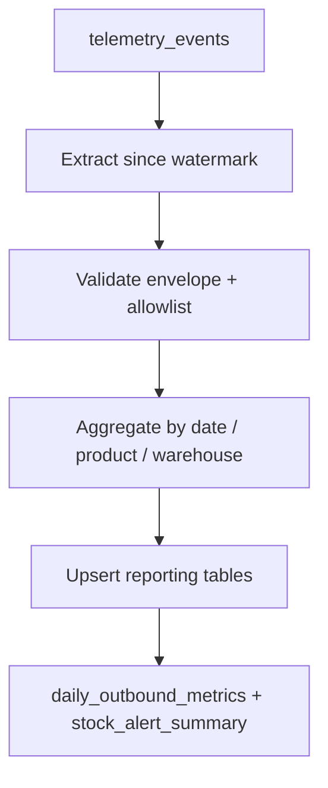

# Pipeline Design Document — Company Inventory Telemetry (Reference Excerpt)

> Instructor/evaluator reference only. Student deliverable: `data/PIPELINE_DESIGN.md` in the company monorepo.

## Current State

We capture inventory telemetry events (`inbound_order_created`, `outbound_order_created`, `direct_stock_edit_rejected`, `order_validation_failed`, `stock_threshold_triggered`) into `public.telemetry_events` via `POST /telemetry/events`. A Pandas script in `data/reports/weekly_ops.ipynb` reads the full table and exports CSV summaries for outbound volume and threshold triggers.

**Limitations:**

- No run log — cannot tell if a partial CSV was written before a crash.
- Full-table scan every run — does not scale as event volume grows.
- Re-running the notebook duplicates exported rows; no watermark or `run_id`.
- Late-arriving events for a prior day are missed until someone manually re-runs the notebook.

## Purpose

This pipeline incrementally processes inventory telemetry from `telemetry_events` into `reporting.daily_outbound_metrics` and `reporting.stock_alert_summary` so operations receives reliable daily KPIs without manual notebook runs.

## Extraction Format

| Attribute | Value                                                                  |
| --------- | ---------------------------------------------------------------------- |
| Source    | `public.telemetry_events` (Supabase Postgres)                          |
| Format    | JSON `properties` column + Event Envelope fields                       |
| Refresh   | Near-real-time inserts; pipeline runs nightly at 02:00 UTC             |
| Window    | Events where `timestamp > last_watermark` and `eventName` in allowlist |

## Data Flow Diagram

Dedup/idempotency enforced at **E** via upsert keys. Watermark advanced only after successful load.

## Update / Dedup Strategy

- **Event-level:** skip rows whose `eventId` already exists in `pipeline.processed_event_ids` (insert-on-conflict-do-nothing).
- **Aggregate-level:** upsert `reporting.daily_outbound_metrics` on `(report_date, warehouse_id)` — recomputes counts when late events arrive within the 7-day reprocess window.

## Idempotency Plan

1. Start run → insert `pipeline_runs` row with `status = running`, `run_id`.
2. Extract/transform write to `staging.*` tagged with `run_id`.
3. Load executes single transaction: upsert reporting tables, insert processed `eventId`s, update watermark.
4. On load failure: transaction rolls back; `pipeline_runs.status = failed`, checkpoint = `pre_load`. Retry reuses staging if still valid, otherwise re-extracts same window — upsert prevents duplicate reporting rows.

## Execution Log

| Field            | Type        | Justification                                  |
| ---------------- | ----------- | ---------------------------------------------- |
| `run_id`         | UUID        | Trace one execution across Prefect logs and DB |
| `started_at`     | timestamptz | Incident timeline                              |
| `finished_at`    | timestamptz | Duration / SLA monitoring                      |
| `watermark_from` | timestamptz | Audit processed range start                    |
| `watermark_to`   | timestamptz | Audit processed range end                      |
| `rows_extracted` | integer     | Detect empty windows                           |
| `rows_loaded`    | integer     | Reconcile with reporting counts                |
| `status`         | enum        | Alerting automation                            |
| `error_summary`  | text        | Ops-readable failure reason                    |

## Prefect Mapping

| Concept | Name                         | Role                                                   |
| ------- | ---------------------------- | ------------------------------------------------------ |
| Flow    | `nightly_telemetry_etl_flow` | Scheduled nightly orchestration                        |
| Flow    | `telemetry_backfill_flow`    | Manual date-range reprocess                            |
| Task    | `extract_telemetry_events`   | Query Supabase since watermark                         |
| Task    | `transform_kpi_aggregates`   | Validate + aggregate to KPI grain                      |
| Task    | `load_reporting_tables`      | Transactional upsert + watermark advance               |
| States  | Running / Completed / Failed | Per flow run; Failed preserves checkpoint              |
| Block   | `SupabaseCredentials`        | DB connection string + service role key                |
| Block   | `PipelineConfig`             | Watermark table, batch size, reprocess window (7 days) |
