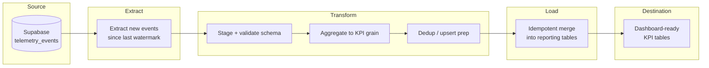

# Company's Data Pipeline Design — Reference Solution

This reference solution defines the expected quality bar for deliverables in the student's company monorepo fork:

- `data/PIPELINE_DESIGN.md`

The deliverable is **design documentation only** — no Prefect flows, Python scripts, migrations, or runnable ETL code. Another engineer should be able to implement the pipeline from this document without follow-up questions.

## Alignment with company context

All event names, table names, KPIs, and business constraints must come from the student's assigned **CONTEXT-company.md**. Generic placeholders that ignore sector-specific telemetry or entity naming should be treated as incomplete.

---

## Expected deliverable structure

### `data/PIPELINE_DESIGN.md`

A complete design should include at least:

| Section                     | What a strong submission covers                                                                                                                                                                |
| --------------------------- | ---------------------------------------------------------------------------------------------------------------------------------------------------------------------------------------------- |
| **Current State**           | Telemetry events already captured, storage location (e.g. Supabase table), Pandas reports already generated, and explicit limitations (no run log, no idempotent re-run, no dedup on updates). |
| **Purpose**                 | One concrete sentence tying the pipeline to company business value — not only "move data to a warehouse."                                                                                      |
| **Extraction format**       | Source (table/API/file), format, refresh frequency, and volume expectations grounded in CONTEXT.                                                                                               |
| **Data flow diagram**       | Mermaid or text diagram with extract → transform → load using real table/entity names from the company.                                                                                        |
| **Update / dedup strategy** | Concrete mechanism for sources that insert updates as new rows (upsert, latest-by-timestamp, control table).                                                                                   |
| **Idempotency strategy**    | What happens on the **second run** after a load-phase failure — staging, transactional merge, checkpoints.                                                                                     |
| **Execution log**           | ≥5 fields with name, type, and audit justification.                                                                                                                                            |
| **Prefect mapping**         | ≥2 flows, ≥3 tasks, relevant states, and blocks for credentials/config.                                                                                                                        |

---

## Pipeline architecture (reference)

**Key decisions annotated on the diagram:**

- Extract uses a **watermark** (`last_processed_at` or `pipeline_runs` checkpoint) — not full-table scans every run.
- Dedup/upsert happens **after** staging, **before** reporting merge.
- Load phase is a single transactional upsert keyed on business identifiers from CONTEXT.

---

## Indicative example — Current State (strong vs weak)

**Strong:**

> We capture five inventory telemetry events (`inbound_order_created`, `outbound_order_created`, `direct_stock_edit_rejected`, `order_validation_failed`, `stock_threshold_triggered`) into `public.telemetry_events` via the FastAPI ingestion endpoint. A manual Pandas notebook reads the full table nightly and produces weekly outbound volume and stock-threshold counts. There is no execution log: if the notebook fails after writing one CSV, we cannot tell which date range was processed. Re-running the notebook duplicates rows in exported CSVs because there is no idempotency key per run.

**Weak (incomplete):**

> We have telemetry in Supabase and use Pandas for reports.

---

## Indicative example — Purpose (strong vs weak)

**Strong:**

> This pipeline transforms raw inventory telemetry in `telemetry_events` into `reporting.daily_outbound_metrics` and `reporting.stock_alert_summary` so operations can monitor outbound fulfillment and low-stock trends without re-running ad hoc Pandas notebooks.

**Weak (incomplete):**

> The pipeline loads telemetry data into reporting tables for dashboards.

---

## Indicative example — Update / dedup strategy

Telemetry events are append-only, but **aggregated KPI rows** may be recomputed when late events arrive. Document one of:

1. **Upsert by grain** — e.g. `(report_date, product_id, warehouse_id)` with `ON CONFLICT DO UPDATE` replacing metrics.
2. **Watermark + reprocess window** — re-aggregate last N days when new events land after cutoff.
3. **Control table** — `processed_event_ids` to skip already-ingested `eventId` values from the Event Envelope.

**Common mistake:** saying "use DISTINCT" without naming the business key or handling late arrivals.

---

## Indicative example — Idempotency plan

**Failure scenario:** pipeline fails after loading 60% of daily aggregates into `reporting.daily_outbound_metrics`.

**Recovery:**

1. Each run has a unique `run_id` logged at start in `pipeline_runs`.
2. Load writes to a staging table or uses a **transactional upsert** — no partial commits without markers.
3. `pipeline_runs.checkpoint` stores last completed phase (`extract`, `transform`, `load`).
4. On retry after load failure: skip extract/transform if inputs unchanged; re-run load upsert only — upsert keys prevent duplicate reporting rows.

**Common mistake:** "re-run the whole job" without explaining how already-committed rows are not duplicated.

---

## Execution log — minimum fields (reference)

| Field                             | Type                                  | Rationale                                              |
| --------------------------------- | ------------------------------------- | ------------------------------------------------------ |
| `run_id`                          | UUID                                  | Correlate logs, metrics, and alerts for one execution. |
| `started_at` / `finished_at`      | ISO 8601 UTC                          | SLA tracking, duration trends, incident timelines.     |
| `watermark_from` / `watermark_to` | ISO 8601 UTC                          | Audit which event time range was processed.            |
| `rows_extracted`                  | integer                               | Detect empty or truncated source windows.              |
| `rows_loaded`                     | integer                               | Reconcile with reporting table counts.                 |
| `status`                          | enum (`success`, `failed`, `partial`) | Automation and paging rules.                           |
| `error_summary`                   | string (nullable)                     | Human-readable failure without scraping stack traces.  |
| `pipeline_version`                | semver / git sha                      | Reproducibility when logic changes.                    |

At least **five** fields with type and justification are required by the rubric.

---

## Prefect mapping (reference)

| Prefect concept | Example mapping                                                                                                                               |
| --------------- | --------------------------------------------------------------------------------------------------------------------------------------------- |
| **Flow**        | `telemetry_etl_flow` — orchestrates nightly run; `backfill_flow` — reprocesses date range on demand.                                          |
| **Task**        | `extract_telemetry_events`, `transform_kpi_aggregates`, `load_reporting_tables`                                                               |
| **States**      | `Running` during extract/transform/load; `Completed` when `pipeline_runs.status = success`; `Failed` triggers alert and preserves checkpoint. |
| **Blocks**      | `SupabaseCredentials` (DB URL + service key), `PipelineConfig` (watermark table, batch size, reprocess window days).                          |

Tasks should align with ETL stages in the data flow diagram — not arbitrary micro-steps.

---

## Common mistakes (incomplete submissions)

- Generic table names (`events`, `metrics`) instead of CONTEXT entity names.
- Data flow diagram with only two stages or missing real source/destination names.
- Idempotency described as a wish ("should be idempotent") without second-run behavior.
- Execution log listing field names without types or audit justification.
- Prefect section naming one flow and one task, or listing Prefect concepts without pipeline-specific names.
- No Current State section — jumps straight to ideal architecture ignoring existing Pandas scripts.
- Implementation code added to the monorepo when the brief asks for design only.

---

## Evaluation checklist

- [ ] `data/PIPELINE_DESIGN.md` exists; design doc only — no orchestration code.
- [ ] Current State documents captured events, storage, existing Pandas reports, and limitations.
- [ ] Purpose is one sentence mentioning company business value.
- [ ] Extraction format names real source, format, and refresh cadence.
- [ ] Diagram shows extract → transform → load with CONTEXT table/entity names.
- [ ] Update/dedup strategy uses a concrete mechanism, not generic DISTINCT.
- [ ] Idempotency describes second run after load failure.
- [ ] Execution log has ≥5 fields with name, type, and justification.
- [ ] Prefect mapping: ≥2 flows, ≥3 tasks, states, and ≥1 block.
- [ ] Design consistent with telemetry events and KPIs from CONTEXT-company.md.
- [ ] Commit message `feat: add pipeline design document`.

---

## Auxiliary reference

See `PIPELINE_DESIGN.example.md` in this folder for a condensed sample document illustrating tone and depth. Students should write their own design in `data/PIPELINE_DESIGN.md` — do not copy verbatim.
