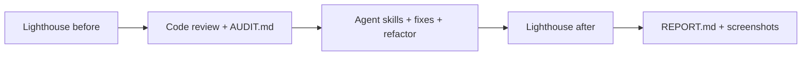

# Frontend Performance Audit — Reference Solution

## Purpose

Reference for a complete submission inside the **company monorepo** (`ai-engineering-company-project-monorepo`): evidence-based Lighthouse audits on **both** Next.js frontends (corporate `website` + `backoffice`), at least one shared abstraction extracted, targeted fixes (not a rewrite), and bilingual-quality documentation in `AUDIT.md` and `REPORT.md`.

## Audit loop (expected workflow)



| Phase      | Artifact                                           | Location                          |
| ---------- | -------------------------------------------------- | --------------------------------- |
| Baseline   | Lighthouse screenshots                             | `audit/before/`                   |
| Analysis   | Scores, issues, root causes, refactor candidates   | `AUDIT.md` (repo root or `docs/`) |
| Fixes      | Code changes in `uis/website` and `uis/backoffice` | Monorepo app folders              |
| Validation | Lighthouse screenshots                             | `audit/after/`                    |
| Summary    | Before/after comparison, impact notes              | `REPORT.md`                       |

Run Lighthouse on **high-traffic or heavy views** (home + one complex page per app), **desktop and mobile** on the corporate site, at minimum dashboard or densest backoffice view.

## Required deliverable structure

### `audit/before/` and `audit/after/`

Committed PNG captures per audited URL and mode, e.g.:

```
audit/
├── before/
│   ├── website-home-desktop.png
│   ├── website-home-mobile.png
│   ├── backoffice-dashboard-desktop.png
│   └── ...
└── after/
    └── (same naming after fixes)
```

### `AUDIT.md` (indicative outline)

```markdown
# Performance audit

## Baseline scores

| App        | Page       | Mode    | Performance | A11y | Best Practices | SEO |
| ---------- | ---------- | ------- | ----------- | ---- | -------------- | --- |
| website    | /          | desktop | 72          | 91   | 88             | 85  |
| backoffice | /dashboard | desktop | 65          | 89   | 92             | N/A |

## Issues and root causes

### 1. Large unoptimized hero image (website home)

- **Symptom:** LCP > 4s, Performance 72
- **Root cause:** Full-size PNG served without `next/image`, no width/height
- **Fix direction:** `next/image` + WebP + explicit dimensions

## Refactor candidates

### Duplicate loading skeleton (website + backoffice)

- **Locations:** `uis/website/...`, `uis/backoffice/...`
- **Proposal:** `uis/shared/components/LoadingSkeleton.tsx` or `useLoadingState` hook
```

### `REPORT.md` (indicative outline)

```markdown
# Performance report

## Changes applied

1. Hero image → `next/image` with priority and sizes
2. Extracted `LoadingSkeleton` shared component
3. Font `display: swap` on global CSS

## Score delta

| App     | Metric                     | Before | After | Delta |
| ------- | -------------------------- | ------ | ----- | ----- |
| website | Performance (home, mobile) | 58     | 74    | +16   |

## Highest impact

Image optimization on LCP element; refactor reduced duplicate markup but minor score change.
```

## Refactor example (shared Custom Hook)

Duplicate fetch + loading/error state in two dashboard widgets:

```tsx
// uis/backoffice/hooks/useAsyncData.ts
import { useEffect, useState } from "react";

export function useAsyncData<T>(url: string) {
  const [data, setData] = useState<T | null>(null);
  const [loading, setLoading] = useState(true);
  const [error, setError] = useState<string | null>(null);

  useEffect(() => {
    let cancelled = false;
    setLoading(true);
    fetch(url)
      .then((r) => r.json())
      .then((json) => {
        if (!cancelled) setData(json);
      })
      .catch((e) => {
        if (!cancelled) setError(e.message);
      })
      .finally(() => {
        if (!cancelled) setLoading(false);
      });
    return () => {
      cancelled = true;
    };
  }, [url]);

  return { data, loading, error };
}
```

Integrate in at least **one** backoffice or website module; document the second duplicate you identified even if only one extraction is required for grading.

## Agent skills (optional but evidenced)

If installed (`core-web-vitals`, `performance`, `web-perf`), log in `AUDIT.md` or `REPORT.md`:

- Skill used
- File paths touched
- Classification: **required fix** vs suggestion (only required fixes must ship)

## Common fix patterns (indicative)

| Issue              | Typical root cause              | Fix                                       |
| ------------------ | ------------------------------- | ----------------------------------------- |
| Poor LCP           | Hero image, blocking CSS        | `next/image`, priority, reduce blocking   |
| High CLS           | Images/fonts without dimensions | `width`/`height`, `font-display: swap`    |
| Slow INP           | Heavy client bundles            | Dynamic import, defer non-critical JS     |
| Hydration warnings | Server/client HTML mismatch     | Align props, suppress only when justified |

## Validation checklist

- [ ] Lighthouse before/after on **both** apps with screenshots in `audit/`
- [ ] `AUDIT.md` explains **why**, not only Lighthouse flags
- [ ] At least one shared component or Custom Hook integrated
- [ ] `REPORT.md` shows measurable improvement on ≥1 score per frontend
- [ ] No architectural rewrite; targeted changes only
- [ ] Monorepo still runs (`npm run dev` or project equivalent)

## What we do **not** require

- Perfect 100 scores on every category
- Auditing every route in the monorepo
- Rewriting routing, state management, or folder structure
