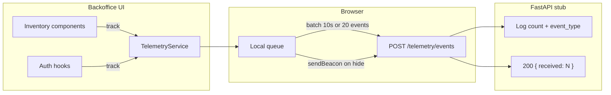

# Telemetry – Frontend capture — Reference Solution

This reference solution defines the expected quality bar for Phase 2 implementation in the student's company monorepo fork. Deliverables span the FastAPI backend stub and the backoffice `TelemetryService` plus instrumentation hooks.

Event names and property allowlists must match the student's approved `docs/telemetry/event-schemas.json` from Phase 1 — this document uses indicative examples only.

---

## Expected file layout

| Area             | Path (indicative)                                           | Purpose                                                |
| ---------------- | ----------------------------------------------------------- | ------------------------------------------------------ |
| Backend router   | `services/app/routers/telemetry.py` (or project equivalent) | `POST /telemetry/events` stub                          |
| Backend schemas  | `services/app/schemas/telemetry.py`                         | `TelemetryEvent`, `TelemetryBatch` Pydantic models     |
| Frontend service | `uis/backoffice/src/services/telemetry.ts`                  | Queue, batch, flush, retry, `track()`                  |
| Frontend hooks   | auth / inventory hooks or components                        | Call `track()` at business events                      |
| Config           | `.env.local`, backend `.env`                                | `NEXT_PUBLIC_TELEMETRY_ENDPOINT`, `TELEMETRY_ENDPOINT` |

---

## Architecture overview



**Separation rule:** profile data (name, role) stays in the main app database. Usage events are append-only telemetry — never mixed.

---

## Phase 1 — FastAPI stub endpoint

### `POST /telemetry/events`

- Accepts body: `{ "events": TelemetryEvent[] }`
- Logs received count and each `event_type` (or `eventName` per student plan — be consistent with Phase 1)
- Returns `200` with `{ "received": <number of events in batch> }`
- Does **not** persist to database (Phase 3)

### Pydantic model `TelemetryEvent`

Minimum envelope fields (align with student's Phase 1 plan):

| Field           | Type              | Notes                              |
| --------------- | ----------------- | ---------------------------------- |
| `eventId`       | string            | UUID                               |
| `timestamp`     | datetime / string | ISO 8601                           |
| `sessionId`     | string            | From frontend                      |
| `userId`        | string            | Authenticated user id              |
| `event_type`    | string            | Taxonomy from plan                 |
| `schemaVersion` | string            | e.g. `1.0.0`                       |
| `properties`    | object            | Event-specific allowlist keys only |

### Environment variable

- Backend reads `TELEMETRY_ENDPOINT` from settings (pattern for Phase 3), even if unused in stub routing.

### Indicative request/response

**Request:**

```json
{
  "events": [
    {
      "eventId": "550e8400-e29b-41d4-a716-446655440000",
      "timestamp": "2026-06-15T10:30:00.000Z",
      "sessionId": "sess_abc123",
      "userId": "user_42",
      "event_type": "outbound_order_created",
      "schemaVersion": "1.0.0",
      "properties": {
        "orderId": "ord_99",
        "productId": "prod_7",
        "quantity": 3
      }
    }
  ]
}
```

**Response:**

```json
{
  "received": 1
}
```

---

## Phase 2 — TelemetryService (frontend)

Single module owns all network I/O for telemetry.

### Responsibilities

| Mechanism            | Spec                                                                                               |
| -------------------- | -------------------------------------------------------------------------------------------------- |
| Local queue          | In-memory array of pending events                                                                  |
| Batch + debounce     | Flush every **10 seconds** OR when queue reaches **20 events** (whichever first)                   |
| Auto-enrichment      | Add `sessionId`, `timestamp` (capture time, ISO 8601), `schemaVersion` — callers do not pass these |
| `userId` / `eventId` | Generated or injected by service (not scattered in components)                                     |
| Reliable flush       | `visibilitychange` → `navigator.sendBeacon` for pending batch                                      |
| Retry                | Up to **3** attempts with exponential backoff; then discard batch                                  |
| Public API           | `track(eventType: string, properties: Record<string, unknown>): void` only                         |

### Endpoint configuration

- Read URL from `process.env.NEXT_PUBLIC_TELEMETRY_ENDPOINT`
- No hardcoded `localhost` in source files

### Indicative service skeleton

```typescript
const SCHEMA_VERSION = "1.0.0";
const FLUSH_INTERVAL_MS = 10_000;
const MAX_QUEUE_SIZE = 20;
const MAX_RETRIES = 3;

let queue: TelemetryEvent[] = [];
let sessionId: string | null = null;

export function track(
  eventType: string,
  properties: Record<string, unknown>,
): void {
  queue.push(buildEvent(eventType, properties));
  if (queue.length >= MAX_QUEUE_SIZE) void flush();
}

// flush(): POST batch to NEXT_PUBLIC_TELEMETRY_ENDPOINT with retry
// visibilitychange listener: sendBeacon fallback
```

---

## Phase 3 — Inventory instrumentation

Minimum events (names must match student plan):

| Event                  | Trigger location                    | Properties (allowlist only)                      |
| ---------------------- | ----------------------------------- | ------------------------------------------------ |
| Inbound order success  | Order submit handler on 2xx         | `orderId`, `productId`, `quantity`, … per schema |
| Outbound order success | Order submit handler on 2xx         | same pattern                                     |
| Order failed           | Validation / API error handler      | `reason`, `productId`, … — no PII                |
| Product list viewed    | Inventory list mount or route enter | `section`, `productCount`, … per schema          |

**Rule:** grep the backoffice — zero `fetch`/`axios` calls for telemetry outside `telemetry.ts`.

---

## Additional activity — Auth instrumentation

Capture in **auth hooks/components** (not per-page):

| Event           | Properties                                                                                                |
| --------------- | --------------------------------------------------------------------------------------------------------- |
| Login success   | plan allowlist only                                                                                       |
| Login failed    | `reason`: `invalid_credentials` \| `session_expired` \| `network_error` — **never** email/password values |
| Session expired | plan allowlist only                                                                                       |

---

## Validation evidence

A complete submission should demonstrate:

1. Network tab: batched `POST` to `/telemetry/events` (not one request per click)
2. Response `200` with `{ "received": N }`
3. Backend logs showing event types in batch
4. `sendBeacon` request on tab close (optional screenshot)
5. PR description listing event → component/hook mapping
6. DevTools screenshot attached to PR

---

## Common mistakes (incomplete submissions)

- Hardcoded telemetry URL instead of `NEXT_PUBLIC_TELEMETRY_ENDPOINT`
- Per-event HTTP calls instead of queue + batch
- Components passing `timestamp` or `sessionId` manually
- Extra properties outside `event-schemas.json` allowlist
- PII in `properties` (email, name, password)
- Direct `fetch` in inventory components bypassing `track()`
- Stub endpoint writing to database (out of scope for this phase)

---

## Evaluation checklist

- [ ] `POST /telemetry/events` stub with `TelemetryEvent` model and `{ "received": N }`
- [ ] `TELEMETRY_ENDPOINT` / `NEXT_PUBLIC_TELEMETRY_ENDPOINT` env pattern established
- [ ] Queue + 10s/20 batch + `sendBeacon` + retry with backoff
- [ ] Single `track()` entry point; auto `sessionId` + `timestamp`
- [ ] Inventory events instrumented with allowlist-only properties
- [ ] No PII in emitted events
- [ ] Network evidence of batched payloads with 200 responses
- [ ] PR title `[W16D47] Telemetry Frontend` with required description content

---

## Reviewer notes

- Event names may differ per company CONTEXT — grade against the student's Phase 1 schemas, not this table verbatim.
- Stub intentionally skips persistence; do not penalize missing Supabase writes.
- Auth instrumentation is bonus unless cohort rubric marks it required.
