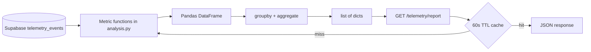

# Company's Telemetry – Report — Reference Solution

This reference solution defines the expected quality bar for Phase 4 in the student's company monorepo fork. Students transform stored `telemetry_events` rows into KPI metrics via a Pandas pipeline and expose them through `GET /telemetry/report`.

Metric definitions must align with the student's Phase 1 `telemetry-plan.md` KPIs — examples below are indicative.

---

## Architecture overview



**Separation rule:** analysis logic lives in `services/telemetry/analysis.py`; the endpoint orchestrates and caches — it does not embed Pandas transforms inline per request without cache.

---

## Expected file layout

| Path                                           | Purpose                      |
| ---------------------------------------------- | ---------------------------- |
| `services/telemetry/analysis.py`               | Independent metric functions |
| `services/telemetry/router.py` (or equivalent) | `GET /telemetry/report`      |
| `services/telemetry/cache.py` (optional)       | In-memory TTL cache helper   |

---

## Phase 1 — Analysis pipeline (`analysis.py`)

### Required pattern per metric function

```
load (SQL filter) → filter (if needed in DF) → convert types → groupby → aggregate → to_dict records
```

### Function signature (indicative)

```python
def outbound_orders_per_day(
    start_date: datetime,
    end_date: datetime,
) -> list[dict]:
    ...
```

### Load from Supabase (filter in query, not full table scan)

```python
rows = repository.fetch_events(
    event_types=["outbound_order_created"],
    start_date=start_date,
    end_date=end_date,
)
df = pd.DataFrame(rows)
```

### Type conversion (mandatory before temporal groupby)

```python
df["timestamp"] = pd.to_datetime(df["timestamp"], utc=True)
df["date"] = df["timestamp"].dt.date
```

### Group and aggregate (no Python loops for metrics)

```python
result = (
    df.groupby("date")["id"]
    .count()
    .reset_index()
    .rename(columns={"id": "order_count"})
    .to_dict(orient="records")
)
return result
```

### Minimum two metric functions

Each must:

- Map to a Phase 1 KPI / business question
- Accept `start_date` and `end_date`
- Return grouped data (not a single global number)
- Be pure (same inputs → same outputs, no side effects)
- Use only Pandas aggregations — no `for` loops over rows to compute counts

### Indicative metric examples

| Function key                  | Business question                 | Grouping             | Aggregation                             |
| ----------------------------- | --------------------------------- | -------------------- | --------------------------------------- |
| `outbound_orders_per_day`     | How many outbound orders per day? | `date`               | `.count()`                              |
| `validation_failures_per_day` | Where do orders fail most often?  | `date`               | `.count()` on `order_validation_failed` |
| `events_by_type_per_day`      | Which event types dominate?       | `date`, `event_type` | `.count()`                              |

### Additional activity — `auth_failure_rate`

Daily ratio per day:

```
failed / (failed + succeeded)
```

Grouped by `date`, values in `[0.0, 1.0]`. Include under `metrics.auth_failure_rate` when auth events were instrumented in Phase 2.

---

## Phase 2 — `GET /telemetry/report`

### Query parameters

| Param        | Required | Default                 |
| ------------ | -------- | ----------------------- |
| `start_date` | no       | now − 7 days (ISO 8601) |
| `end_date`   | no       | now (ISO 8601)          |

### Response shape

```json
{
  "period": {
    "from": "2026-06-08T00:00:00Z",
    "to": "2026-06-15T23:59:59Z"
  },
  "metrics": {
    "outbound_orders_per_day": [
      { "date": "2026-06-14", "order_count": 12 },
      { "date": "2026-06-15", "order_count": 8 }
    ],
    "validation_failures_per_day": [
      { "date": "2026-06-14", "failure_count": 3 }
    ]
  }
}
```

### Cache requirement

- In-memory cache keyed by `(start_date, end_date)` (or normalized period string)
- TTL: **60 seconds**
- On cache hit: return stored JSON without re-running Pandas pipeline

```python
@lru_cache or custom dict with expiry timestamp
```

---

## Prerequisites

- `telemetry_events` has **≥20 rows** with varied `event_type` values from real backoffice activity
- Phase 1 KPI names inform metric keys in response

---

## PR deliverables

- Names of two metrics + business question each answers
- Sample JSON from `GET /telemetry/report` with real data
- Note if `auth_failure_rate` was implemented
- PR title: `[W17D49] Telemetry Report`

---

## Common mistakes (incomplete submissions)

- `groupby()` on string timestamps → silent wrong buckets
- Loading entire `telemetry_events` table into memory
- Global scalar counts without date dimension
- Pandas logic copy-pasted inside endpoint handler on every request (no cache)
- Loops over DataFrame rows to sum/count
- Metric functions with DB writes or mutation side effects

---

## Evaluation checklist

- [ ] `services/telemetry/analysis.py` with ≥2 independent metric functions
- [ ] Pipeline order: load → filter → convert → group → aggregate
- [ ] `pd.to_datetime(..., utc=True)` before temporal groupby
- [ ] Pandas-only aggregation (no metric loops)
- [ ] Returns `list[dict]` JSON-serialisable
- [ ] `GET /telemetry/report` with optional dates, default 7 days
- [ ] Response `{ period, metrics }` structure
- [ ] 60-second in-memory cache
- [ ] Grouped metrics with temporal (or other) dimension

---

## Reviewer notes

- Metric names/keys may differ per CONTEXT — grade against student's Phase 1 plan.
- Accept equivalent cache implementations if TTL and keying are correct.
- Empty periods should return `[]` for metrics, not errors, when no events match filters.
