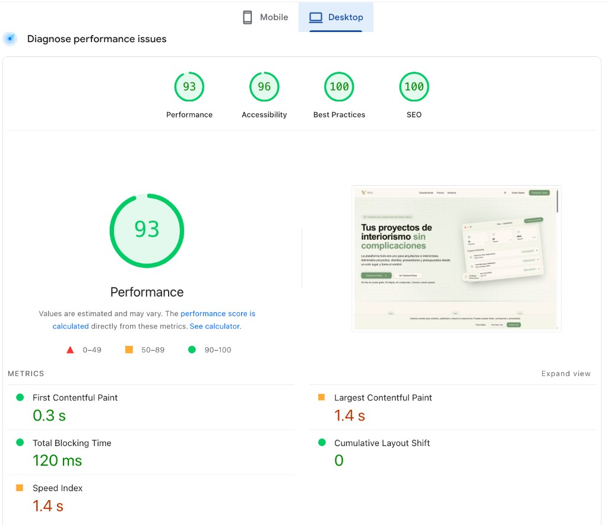

# Un website para mostrar el talento de tu amigo artista

<!-- hide -->

> Por [@marcogonzalo](https://github.com/marcogonzalo), [@ehiber](https://github.com/ehiber) y [otros contribuidores](https://github.com/4GeeksAcademy/ai-engineering-syllabus/graphs/contributors) en [4Geeks Academy](https://4geeksacademy.co/)

[](https://4geeks.com)
[](https://twitter.com/4geeksacademy)

_These instructions are [available in english](https://github.com/4GeeksAcademy/html-css-artist-landing-seo-access/blob/main/README.md)_

### Antes de empezar...

> ¡Te necesitamos! Estos ejercicios se construyen y mantienen en colaboración con personas como tú. Si encuentras algún error o falta de ortografía, por favor contribuye y/o repórtalos.

<!-- endhide -->

## Tu Reto

Has decidido tirarte de cabeza en el mundo de la AI Engineering. Y mientras aprendes fundamentos de HTML, CSS y SEO, te ha surgido la primera oportunidad de hacer un _website_ para un amigo artista que necesita darse a conocer y exponer su talento.

Estás empezando, por lo que harás una versión inicial que más adelante podrás hacer crecer, pero no por eso dejará de ser un trabajo de calidad, mucho menos si lo haces en compañía de la IA. Así que ¡da lo mejor de ti! 😁

Tras conversar con tu amigo, deciden comenzar con una primera versión que le permita tener presencia en internet. Será una sola página, a modo de landing page, que deberá tener su barra de navegación con enlaces principales (sobre mí, trayectoria, próximas presentaciones) que llevarán a las distintas secciones del contenido. Y como todo libro, debe tener una buena portada; así que también habrá que incorporar una primera sección que dé la bienvenida a esa web.

Cada sección debe ocupar aproximadamente el alto de una pantalla del computador, como si viéramos una única página.

Y ten en cuenta que en internet hay dos cosas muy importantes:

1. No todo el mundo tiene las mismas capacidades visuales, así que es importante identificar los elementos con etiquetas de accesibilidad que las personas con diversidad funcional visual o usuarios de lectores de pantalla puedan navegar en ella.
2. La indexación en buscadores es crucial para que te puedan encontrar, así que no olvides los principios de SEO y añade el etiquetado que consideres conveniente, tanto de HTML semántico como de Schema.org.

## 🌱 Cómo Comenzar Este Proyecto

No clones este repositorio porque vamos a usar una plantilla diferente.

Recomendamos abrir `el repositorio de plantilla html` usando una herramienta de aprovisionamiento como [Codespaces](https://4geeks.com/lesson/what-is-github-codespaces) (recomendado). Alternativamente, puedes clonarlo en tu computadora local usando el comando git clone.

Este es el repositorio que necesitas abrir o clonar:

```
https://github.com/4GeeksAcademy/html-hello
```

**Por favor sigue estos pasos sobre** [cómo comenzar un proyecto de programación](https://4geeks.com/es/lesson/como-comenzar-un-proyecto-de-codificacion).

💡 Importante: Recuerda guardar y subir tu código a GitHub creando un nuevo repositorio, actualizando el remoto (`git remote set-url origin <tu nueva url>`), y subiendo el código a tu nuevo repositorio usando los comandos `add`, `commit` y `push` desde la terminal de git.

## 📝 Instrucciones

Antes de desarrollar, determina a partir del enunciado **qué estructura acordaste con tu amigo artista**: qué secciones hay, en qué orden y qué contenido tiene cada una. Piensa la página como un conjunto de **cajas** (cabecera, hero, sobre mí, trayectoria, próximas presentaciones, pie) y diseña el layout de fuera hacia dentro.

Así podrás definir una **estrategia** y usar **HTML semántico** (p. ej. `<header>`, `<nav>`, `<main>`, `<section>`, `<footer>`) para que la estructura tenga sentido tanto para usuarios como para buscadores.

> **Nota:** El sitio debe ser atractivo; puedes usar Flexbox para el layout, mantener el CSS DRY y, si quieres, una metodología como BEM. Como extra, animaciones opcionales.

---

## 💻 Qué debes hacer

Para cumplir el encargo de tu amigo:

- [ ] **Estructura:** Crear un único documento HTML (`index.html`) con jerarquía clara: esquema del documento, barra de navegación con enlaces a secciones (sobre mí, trayectoria, próximas presentaciones), sección hero y una sección por tema que ocupe aproximadamente la altura de la pantalla.
- [ ] **HTML semántico:** Usar etiquetas semánticas (`<header>`, `<nav>`, `<main>`, `<section>`, `<article>`, `<footer>`, etc.) para que el contenido sea comprensible e indexable. Evitar usar solo `<div>` para la estructura.
- [ ] **Layout y estilos:** Usar un archivo CSS aparte (`styles.css`). Usar **Flexbox** para el layout; evitar `float` o `display: inline-block` para la estructura de la página. Mantener estilos ordenados (DRY, selectores claros).
- [ ] **Accesibilidad:** Añadir etiquetas y roles para que usuarios de lectores de pantalla puedan navegar: `aria-label` donde haga falta, `alt` en imágenes, niveles de encabezado correctos (`h1` → `h2` → …) y elementos interactivos enfocables.
- [ ] **SEO / Schema.org:** Incluir datos estructurados **Schema.org** (JSON-LD o Microdata) que describan al artista o su obra (p. ej. Person, CreativeWork) para que los buscadores entiendan la página.
- [ ] **Organización de archivos:** Mantener HTML y CSS en archivos separados y correctamente enlazados.

> **⚠️ IMPORTANTE:** Indica a la IA que en este proyecto **solo usas HTML y CSS** —sin JavaScript ni frameworks— y que no use una plantilla prefabricada; debes construir la estructura a partir de los requisitos anteriores.

---

## ✅ Qué vamos a evaluar

- [ ] **HTML válido y bien formateado** y jerarquía correcta de etiquetas (sin etiquetas sin cerrar o mal anidadas).
- [ ] **Uso estricto de HTML semántico** para que se identifiquen secciones y landmarks (header, nav, main, footer).
- [ ] **Calidad del CSS:** Presentación atractiva y moderna; layout con Flexbox; estilos organizados y sin redundancia.
- [ ] **Organización correcta de archivos:** `index.html` y `styles.css` separados y enlazados correctamente.
- [ ] **Accesibilidad:** Uso correcto con lectores de pantalla (p. ej. `aria-label`, `alt`, jerarquía de encabezados).
- [ ] **Schema.org:** Datos estructurados (JSON-LD o Microdata) que describan al artista o su obra.
- [ ] **Requisitos:** Todas las secciones acordadas (navbar, hero, sobre mí, trayectoria, próximas presentaciones) presentes y navegables.
- [ ] **Rendimiento (PageSpeed Insights):** Verificar la URL pública del proyecto en [PageSpeed Insights](https://pagespeed.web.dev/) y obtener **al menos 80 puntos** de puntuación (idealmente, **más de 90**).

---

## 📦 Cómo entregar

Sigue los pasos habituales de entrega para subir tu repositorio a GitHub y compártelo según las indicaciones de tu instructor.
Incluye en el repositorio una captura del resultado de PageSpeed de la URL pública del proyecto (por ejemplo, `pagespeed-result.png`).


## Contribuidores

Este y muchos otros proyectos son construidos por estudiantes como parte del [4Geeks Academy Bootcamp](https://4geeksacademy.co/). Por [@marcogonzalo](https://github.com/marcogonzalo), [@ehiber](https://github.com/ehiber) y [otros contribuidores](https://github.com/4GeeksAcademy/ai-engineering-syllabus/graphs/contributors). Descubre más sobre nuestro [Curso de AI Engineering](https://4geeksacademy.com/es/coding-bootcamps/ingenieria-ia?lang=es).
