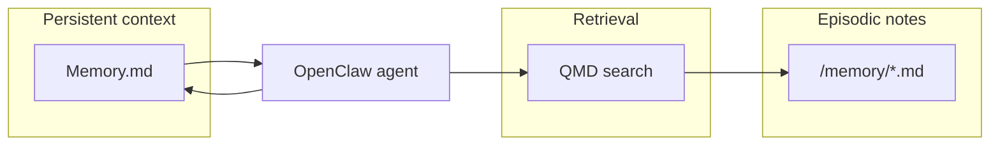

# Give Your Agent a Memory — Reference Solution

## Purpose

This document describes what a **complete submission** looks like for this assignment: a justified personal memory architecture in the student's OpenClaw workspace, persistent context in `Memory.md`, episodic notes under `/memory`, and QMD configured as the memory search backend (keyword + semantic + reranking).

Students work in their **existing OpenClaw configuration directory** (not a new monorepo fork). The branch `feature/memory-setup` should contain the memory artifacts and configuration changes.

## Expected workspace layout

- **`MEMORY_DESIGN.md`** (or a dedicated top section in `Memory.md`) — one paragraph on the personal use case, justification for memory types chosen, what `mem0` would add, and why it was or was not adopted.
- **`Memory.md`** — persistent context:
  - Student name and working context (role, current projects).
  - At least **3** behavioral rules for the agent (language, tone, always/never behaviors).
  - Project-specific context aligned with the chosen use case.
- **`/memory/`** — at least **2** episodic entries with a consistent naming convention (e.g. `YYYY-MM-DD-topic.md`), each with: date, context, key facts/decisions, follow-up actions.
- **QMD configuration** — replaces default `memory_search`; keyword search, semantic similarity, and reranking enabled.
- **Branch** — `feature/memory-setup` pushed to the student's GitHub repo.

## Memory architecture (conceptual)

| Layer          | Role                                         | Example content                                       |
| -------------- | -------------------------------------------- | ----------------------------------------------------- |
| `Memory.md`    | Always-loaded identity, rules, project state | Name, preferred language, current module, agent rules |
| `/memory/*.md` | Session logs, decisions, resources found     | Daily decision log, course progress note              |
| QMD            | Query episodic + indexed content on demand   | "What did I decide about the auth library last week?" |

## Required coverage (from README)

- Real personal use case (not placeholder); architecture choice explained in writing.
- `Memory.md` with structured, meaningful content (no lorem ipsum).
- ≥ 2 episodic files in `/memory` with consistent format and real content.
- QMD installed and configured; default memory search replaced.
- Manual retrieval test documented in `MEMORY_DESIGN.md` (query + result).
- Fresh-session verification: agent recalls ≥ 2 facts from `Memory.md` (screenshot or log).
- Retrieval test: a question that should hit `/memory` returns relevant content (screenshot or log).
- `mem0` not used as primary solution unless clearly justified; justification quality is what matters.

## Validation evidence (what instructors look for)

1. **Design** — `MEMORY_DESIGN.md` (or equivalent section) with use case, type justification, and `mem0` comparison.
2. **Persistent context** — `Memory.md` shows real student context and ≥ 3 agent rules.
3. **Episodic** — two dated files under `/memory` with structured sections.
4. **QMD** — config snippet or `openclaw` config showing QMD as search method with all three retrieval modes enabled.
5. **Manual query** — documented test in design doc: query string + excerpt of returned content.
6. **Session recall** — screenshot or terminal/log from a **new** session showing the agent using `Memory.md` facts without re-prompting.
7. **Memory search** — screenshot or log showing a `/memory`-backed answer to a natural-language question.

## Indicative examples (not prescriptive)

**Use case — course progress tracker**

- `Memory.md`: current module, pending project slugs, preferred check-in style.
- `/memory/2026-05-18-module-3.md`: completed labs, blockers, next session goal.
- QMD query: `"openclaw memory projects pending"` → surfaces latest episodic note.

**Use case — daily decision log**

- `Memory.md`: stack preferences, "always cite file paths" rule.
- `/memory/2026-05-17-auth-library.md`: chose library X over Y, benchmark notes, follow-up to add tests.

## What is out of scope for a passing solution

- Using `mem0` as the main memory layer without explaining why file-based memory + QMD is insufficient.
- Placeholder `Memory.md` or empty episodic files.
- Leaving default `memory_search` unchanged while claiming QMD is configured.
- Generic `MEMORY_DESIGN.md` with no personal use case or retrieval test documentation.

## Alignment with evaluation rubric

Full credit requires **documented architecture reasoning**, **working QMD retrieval**, and **demonstrated recall in a fresh session** — not merely creating empty files. The quality of `mem0` integration is not graded; the written decision to use or skip it is.
