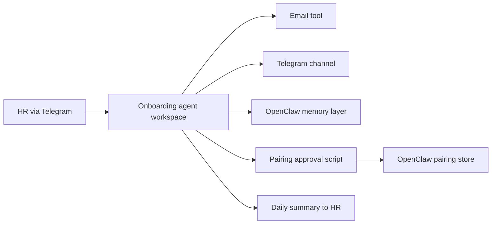

# Onboarding Agent with Memory — Reference Solution

## Purpose

This project extends the learner’s OpenClaw work into a **company-scoped onboarding agent** that persists process state across restarts. A complete submission is not a traditional web API: it is an **isolated OpenClaw workspace**, a **pairing-approval skill** (server-side script), a documented **memory strategy**, and evidence that the full HR → email → Telegram → verification → onboarding → daily summary flow runs end to end.

## Architecture (high level)



| Component | Responsibility |
|-----------|----------------|
| **Dedicated workspace** | Role, restrictions, and behaviour separate from the personal OpenClaw workspace |
| **Telegram** | HR notifications, new-hire contact, codes, greetings, daily summaries |
| **Email** | Welcome message with instruction to message the bot on Telegram |
| **Memory** | Per-employee state: identity, status (`not started` / `active` / `completed`), deliverables, dates, state-change history |
| **Pairing skill** | Server script: approve pending Telegram pairing **only** when verification code argument matches |
| **Daily job** | Morning summary to HR: counts by status + state changes since previous day |

## Expected deliverables (monorepo / learner repo)

1. **New OpenClaw workspace** — configuration `.md` files (role, restrictions, onboarding behaviour); no shared channels or context with the personal workspace.
2. **Telegram channel** — installed and used in the onboarding workspace only.
3. **Email integration** — agent can send welcome email autonomously during the flow.
4. **Pairing approval skill** — executable script accepting verification code; logs each approval (who, when, code used); README note on why this is safer than blanket manual approval.
5. **`MEMORY-DECISION.md`** — chosen memory type (`Memory.md`, `/memory`, or mem0), retrieval strategy (exact / text / semantic), and explicit consistency argument for this use case.
6. **Flow implementation** — all steps in the README mermaid diagram, aligned with the learner’s `CONTEXT-company.md` (fields, HR roles, instructions, deliverables).

## Memory model (indicative)

Regardless of mechanism, each active onboarding record should be recoverable after restart. Example shape stored in memory:

```json
{
  "employee_id": "onb-2026-0042",
  "name": "Alex Rivera",
  "email": "alex.rivera@example.com",
  "status": "active",
  "deliverables_received": ["signed-policy", "equipment-form"],
  "deliverables_pending": ["security-training"],
  "verification_code": "<redacted-in-logs>",
  "pairing_approved_at": "2026-05-20T09:14:00Z",
  "started_at": "2026-05-19T14:00:00Z",
  "state_changes_since_last_summary": 2
}
```

**Status classification** (required for daily summary):

- **Not started** — HR reported the hire; no Telegram contact yet.
- **Active** — In communication with the bot; onboarding in progress.
- **Completed** — All steps and deliverables fulfilled.

## Pairing skill (security)

- Script runs **on the server**, not from chat.
- Approves **only if** the code argument matches the code issued to the new hire.
- Append-only log: approved identity, timestamp, code reference (never commit secrets).
- Project README explains: scoped auto-approval after HR-mediated verification reduces risk vs. approving every unknown Telegram user manually.

## Required coverage (from README checklist)

- Isolated workspace vs. personal workspace
- Workspace `.md` role and restrictions
- Telegram + email in the onboarding workspace
- Pairing skill with code-gated approval and logging
- `MEMORY-DECISION.md` with justified memory type and retrieval strategy
- Persistent per-employee state across agent restarts
- Full flow: HR notify → welcome email → Telegram contact → code → HR code to bot → approve → greet + instructions → deliverables → complete
- Daily summary: three categories + count of state changes since previous day
- All HR roles, fields, instructions, and deliverables match `CONTEXT-company.md`

## Indicative daily summary (Telegram to HR)

```text
Onboarding summary — 2026-05-20

Not started: 1
Active: 3
Completed: 12

State changes since yesterday: 4

Details:
- onb-2026-0042 Alex Rivera: active → (awaiting security-training)
- onb-2026-0038 Sam Lee: active → completed
```

## Evaluation alignment

- Workspace separation and dedicated configuration files
- Email sent autonomously during the flow
- Pairing script exists, is code-gated, and logs approvals
- `MEMORY-DECISION.md` justifies type + retrieval strategy
- State survives restart (not session-only)
- Daily summary uses three statuses and reports state-change count
- End-to-end test with at least one test employee
- Pairing log records who was approved and when

## Validation notes

- Use test employees and test email/Telegram accounts; redact secrets in screenshots and repos.
- Restart the agent mid-flow and confirm the same employee state reloads correctly.
- Run the daily summary with mixed statuses to verify classification and change counter.
- Generic onboarding copy that ignores `CONTEXT-company.md` does not meet the rubric.
