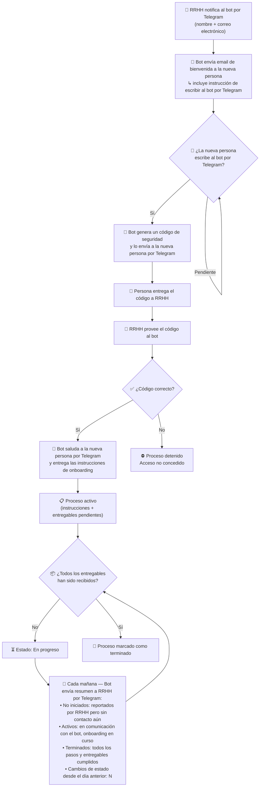

# Agente de Onboarding con Memoria

<!-- hide -->

By [@username](https://github.com/username) and [other contributors](https://github.com/4GeeksAcademy/ai-engineering-company-project-monorepo/graphs/contributors) at [4Geeks Academy](https://4geeksacademy.com/)

_These instructions are [available in English](./README.md)._

<!-- endhide -->

**Antes de empezar:** Lee tu **[CONTEXT-empresa.md](https://github.com/4GeeksAcademy/ai-engineering-syllabus/tree/main/content/contexts)** antes de escribir ningún código — define los campos del empleado, los roles de RRHH, las instrucciones de onboarding y los entregables específicos de tu empresa.

---

## 🎯 El Reto

Ya has construido un workspace personal en OpenClaw y has desarrollado skills que permiten a tu agente interactuar con sistemas externos. Este proyecto da el siguiente paso: tu empresa necesita que el agente no solo ejecute tareas aisladas, sino que **recuerde el estado de un proceso a lo largo del tiempo** y actúe sobre ese estado de forma autónoma, incluso entre reinicios.

El equipo de Personas ha enviado un RFP interno: necesitan un agente que gestione de extremo a extremo el proceso de incorporación de nuevas personas a la empresa. El proceso abarca dos canales de comunicación — correo electrónico y Telegram —, un paso de verificación de identidad y un seguimiento diario del progreso de cada incorporación activa.

### ¿Qué tipo de memoria necesita este agente?

Antes de implementar nada, debes identificar qué tipo de memoria de OpenClaw es el apropiado para este caso de uso. No todos los problemas requieren el mismo mecanismo:

- **`Memory.md`** — memoria persistente escrita por el agente para sí mismo, cargada en cada conversación. Útil para instrucciones permanentes o comportamientos que no cambian entre sesiones.
- **`/memory` (carpeta de notas)** — notas que el agente genera cronológicamente. Útil para registrar eventos, cambios de estado y el historial de un proceso a lo largo del tiempo.
- **mem0** — capa de memoria externa con almacenamiento vectorial. Permite guardar y recuperar información con búsqueda semántica, lo que resulta útil cuando el volumen de registros crece o cuando las consultas no son exactas sino aproximadas (por ejemplo: "¿qué empleados llevan más de una semana sin avanzar?").

La elección del tipo de memoria también implica definir una **estrategia de búsqueda**: ¿cómo recuperará el agente el estado de un empleado concreto? ¿Por identificador exacto, por coincidencia de texto o por similitud semántica? Esa estrategia debe ser coherente con el mecanismo de memoria elegido y quedar documentada en el `MEMORY-DECISION.md`.

Tu decisión sobre qué tipo usar — y por qué — forma parte del entregable de este proyecto. Una implementación que no justifique la elección no estará completa.

### El flujo del agente

El diagrama describe el proceso completo que el agente debe ejecutar. Léelo con atención: hay condiciones, estados intermedios y transiciones que deberán reflejarse en la memoria del agente.

> **Nota sobre el resumen matutino:** el agente clasifica cada proceso en uno de tres estados — no iniciado, activo o terminado — y debe mantener esa clasificación actualizada en memoria entre ejecuciones. El resumen diario refleja el estado real de todos los procesos en el momento del envío, e incluye el número de cambios de estado ocurridos desde el día anterior.

### Brief del tech lead

> > **Ticket #onb-016 — Agente de onboarding con memoria persistente**
> >
> > **Workspace:** crear un workspace nuevo, completamente aislado del workspace personal. El agente de onboarding no debe compartir configuración, contexto ni canales con el agente personal. Esto es un requisito de separación de responsabilidades, no una preferencia.
> >
> > **Punto crítico de seguridad:** el mecanismo de pairing de OpenClaw requiere aprobación manual por defecto. Esto es inviable en este flujo: no podemos pedir a RRHH que apruebe manualmente cada Telegram que escriba al bot. La solución es un skill con un script que apruebe automáticamente los pairings pendientes **si y solo si** recibe el código de verificación correcto como argumento. El script corre en el servidor, no desde el chat — esto es intencional y no debe cambiarse.
> >
> > **Criterio de aceptación principal:** el agente debe ser capaz de retomar cualquier proceso de onboarding activo tras un reinicio sin perder el estado de ningún empleado. Si esto no funciona, el agente no está listo para producción.

---

## 🌱 Cómo Empezar

1. Trabaja en el mismo repositorio que has usado en los proyectos anteriores de OpenClaw.
2. Lee tu **[CONTEXT-empresa.md](https://github.com/4GeeksAcademy/ai-engineering-syllabus/tree/main/content/contexts)** — define los campos del empleado, las instrucciones de onboarding, los entregables requeridos y cualquier restricción específica de tu empresa.
3. Crea un nuevo workspace en OpenClaw dedicado exclusivamente al agente de onboarding.
4. Identifica qué integraciones necesita el flujo según las instrucciones del proceso e instálalas en el nuevo workspace.

---

## 💻 Qué Debes Hacer

### Workspace y configuración del agente

- [ ] Crear un nuevo workspace en OpenClaw, separado del workspace personal existente
- [ ] Configurar los archivos `.md` del workspace con el rol, las restricciones y el comportamiento específico del agente de onboarding
- [ ] Instalar el canal de Telegram en el nuevo workspace
- [ ] Integrar el envío de correo electrónico como herramienta disponible para el agente dentro del workspace

### Skill de aprobación automática de pairings

- [ ] Crear un skill que contenga un script ejecutable para gestionar pairings pendientes en OpenClaw
- [ ] El script debe aceptar el código de verificación como argumento y aprobar el pairing **solo si el código es correcto**
- [ ] El script debe registrar en un log cada aprobación: quién fue aprobado, cuándo y con qué código
- [ ] Incluir en el `README` de la carpeta del proyecto una nota explicando por qué este mecanismo reduce el riesgo de seguridad frente a la aprobación manual

### Configuración de memoria

- [ ] Crear un archivo `MEMORY-DECISION.md` que justifique el tipo de memoria de OpenClaw elegido (`Memory.md`, `/memory` o mem0), la estrategia de búsqueda adoptada (exacta, textual o semántica) y por qué ambas decisiones son coherentes con el caso de uso
- [ ] Configurar la memoria del agente para registrar el estado de onboarding de cada empleado: nombre, correo electrónico, estado actual, entregables recibidos y fecha de inicio del proceso
- [ ] Implementar la lógica que clasifica cada proceso en uno de tres estados — **no iniciado**, **activo** o **terminado** — y mantiene esa clasificación actualizada en memoria para que el resumen matutino la refleje correctamente

### Implementación del flujo

- [ ] Paso 1: el agente recibe la instrucción de RRHH por Telegram (nombre + correo) y registra el inicio del proceso en memoria
- [ ] Paso 2: el agente envía el email de bienvenida a la nueva persona con la instrucción de contactarlo por Telegram
- [ ] Pasos 3–4: al recibir el mensaje de Telegram de la nueva persona, el agente genera y envía el código de seguridad
- [ ] Pasos 5–6: el agente recibe el código desde RRHH y ejecuta el skill de aprobación
- [ ] Paso 7: una vez aprobado, el agente saluda a la nueva persona por Telegram y entrega las instrucciones de onboarding
- [ ] Resumen matutino: implementar la tarea diaria que clasifica todos los procesos (no iniciados, activos, terminados) e indica el número de cambios de estado desde el día anterior
- [ ] Cierre: el agente marca el proceso como terminado cuando todos los entregables han sido recibidos y actualiza la memoria en consecuencia

⚠️ **IMPORTANTE:** Los roles de RRHH, los campos del empleado, las instrucciones de onboarding y los entregables requeridos deben corresponderse exactamente con lo especificado en tu **[CONTEXT-empresa.md](https://github.com/4GeeksAcademy/ai-engineering-syllabus/tree/main/content/contexts)**. Una implementación genérica que ignore el contexto no será aceptada.

---

## ✅ Qué Evaluaremos

- [ ] El nuevo workspace está separado del workspace personal y tiene su propio conjunto de archivos de configuración `.md` con rol y restricciones definidos
- [ ] El canal de email está integrado en el workspace: el agente puede enviar correos de forma autónoma durante la ejecución del flujo
- [ ] El skill de aprobación de pairings existe como script ejecutable, acepta el código como argumento y solo aprueba si el código es correcto
- [ ] El archivo `MEMORY-DECISION.md` justifica el tipo de memoria elegido (`Memory.md`, `/memory` o mem0) y la estrategia de búsqueda adoptada, con argumento explícito de por qué son coherentes con el caso de uso
- [ ] El estado de onboarding de cada empleado es recuperable tras un reinicio del agente — la persistencia es real, no depende de la sesión activa
- [ ] El resumen matutino clasifica correctamente los procesos en tres categorías (no iniciados, activos, terminados) e indica el número de cambios de estado ocurridos desde el día anterior
- [ ] El flujo completo puede ejecutarse de principio a fin sin errores con al menos un empleado de prueba
- [ ] El log del script de pairings registra cada aprobación con el dato de quién fue aprobado y cuándo

---

## 📦 Cómo Entregar

1. Asegúrate de que tu repositorio contenga:
   - Los archivos de configuración del nuevo workspace de OpenClaw
   - El skill de aprobación de pairings con su script
   - El archivo `MEMORY-DECISION.md`
   - Un `README` en la carpeta del proyecto con instrucciones para probar el flujo completo
2. Haz push de tus cambios al repositorio
3. Comparte el enlace al repositorio junto con la descripción del PR: el tipo de memoria elegido y un ejemplo real del estado guardado en memoria para un empleado de prueba

---

Este y muchos otros proyectos son construidos por estudiantes como parte de los [Coding Bootcamps](https://4geeksacademy.com/) de 4Geeks Academy. Encuentra más acerca de los [cursos](https://4geeksacademy.com/es/comparar-programas) de [Full-Stack Software Developer](https://4geeksacademy.com/es/programas-de-carrera/desarrollo-full-stack), [Data Science & Machine Learning](https://4geeksacademy.com/es/programas-de-carrera/ciencia-de-datos-ml), [Ciberseguridad](https://4geeksacademy.com/es/programas-de-carrera/ciberseguridad) e [Ingeniería de IA](https://4geeksacademy.com/es/programas-de-carrera/ingenieria-ia).
