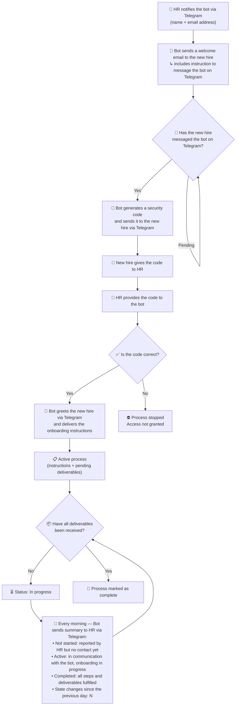

# Onboarding Agent with Memory

<!-- hide -->

By [@username](https://github.com/username) and [other contributors](https://github.com/4GeeksAcademy/ai-engineering-company-project-monorepo/graphs/contributors) at [4Geeks Academy](https://4geeksacademy.com/)

_Estas instrucciones están [disponibles en español](./README.es.md)._

<!-- endhide -->

**Before you start:** Read your **[CONTEXT-company.md](https://github.com/4GeeksAcademy/ai-engineering-syllabus/tree/main/content/contexts)** before writing any code — it defines the employee fields, HR roles, onboarding instructions, and deliverables specific to your company.

---

## 🎯 The Challenge

> 📌 You are building on **your own fork** of the company's **[monorepo](https://github.com/4GeeksAcademy/ai-engineering-company-project-monorepo)** selected at the beginning of the course — not on a new repository.

You have already built a personal workspace in OpenClaw and developed skills that allow your agent to interact with external systems. This project takes the next step: your company needs the agent not just to execute isolated tasks, but to **remember the state of a process over time** and act on that state autonomously, even across restarts.

The People team has submitted an internal RFP: they need an agent that manages the employee onboarding process end to end. The process spans multiple communication channels, an identity verification step, and daily tracking of every active onboarding case.

### What kind of memory does this agent need?

Before implementing anything, you must identify which OpenClaw memory type is appropriate for this use case. Not every problem calls for the same mechanism:

- **`Memory.md`** — persistent memory written by the agent for itself, loaded at the start of every conversation. Useful for permanent instructions or behaviours that do not change between sessions.
- **`/memory` (notes folder)** — notes the agent generates chronologically. Useful for recording events, state changes, and the history of a process over time.

Regardless of which storage mechanism you choose, you must configure **QMD** as the memory search method (replacing the default `memory_search`), with keyword search, semantic similarity, and reranking enabled. QMD is how the agent retrieves onboarding records when the volume of employees grows or when queries are approximate rather than exact (e.g. "which employees have gone more than a week without progressing?").

Choosing a memory type also means defining a **retrieval strategy**: how will the agent look up the state of a specific employee — by exact identifier, text match, or semantic similarity via QMD? That strategy must be consistent with the chosen memory mechanism and documented in `MEMORY-DECISION.md`.

Your decision about which type to use — and why — is part of the deliverable. An implementation that does not justify the choice will not be considered complete.

### Context amnesia

OpenClaw agents start each session with a **limited context window**. Anything that exists only in chat history is lost after a restart or the next day — this is **context amnesia**. For onboarding, that is unacceptable: HR cannot re-enter every employee's state manually.

Before you implement, answer this design question:

> **What should the agent remember if it reboots tomorrow?**

List every fact the agent must still know after a restart (per employee and globally): identity, current status, pending deliverables, verification state, dates, state-change counters, and any rules for the daily summary. Then map each item to **where** it is stored (`Memory.md`, `/memory`, or both) and **how** it is retrieved (QMD query, exact file lookup, etc.).

**Context amnesia must be considered and solved** in your implementation — not merely mentioned. Persistence must be real (written to disk on every state transition), and recovery must be demonstrated after a restart.

### The agent flow

The diagram describes the complete process the agent must execute. Read it carefully: there are conditions, intermediate states, and transitions that must be reflected in the agent's memory.

> **Note on the daily summary:** the agent classifies each process into one of three states — not started, active, or completed — and must keep that classification updated in memory between runs. The daily summary reflects the real state of all processes at the time of sending, and includes the number of state changes that occurred since the previous day.

### Tech lead brief

> > **Ticket #onb-016 — Onboarding agent with persistent memory**
> >
> > **Workspace:** create a new workspace completely isolated from the personal workspace. The onboarding agent must not share configuration, context, or channels with the personal agent. This is a separation-of-concerns requirement, not a preference.
> >
> > **Critical security point:** OpenClaw's pairing mechanism requires manual approval by default. This is not viable in this flow — we cannot ask HR to manually approve every Telegram account that messages the bot. The solution is a skill containing a script that automatically approves pending pairings **if and only if** it receives the correct verification code as an argument. The script runs on the server, not from the chat — this is intentional and must not be changed.
> >
> > **Main acceptance criterion:** the agent must be able to resume any active onboarding process after a restart without losing the state of any employee. If this does not work, the agent is not production-ready.

---

## 🌱 How to Start

1. Work in the same repository you have been using for previous OpenClaw projects.
2. Read your **[CONTEXT-company.md](https://github.com/4GeeksAcademy/ai-engineering-syllabus/tree/main/content/contexts)** — it defines the employee fields, onboarding instructions, required deliverables, and any company-specific constraints.
3. Create a new OpenClaw workspace dedicated exclusively to the onboarding agent.
4. Identify which integrations the flow requires based on the process instructions and install them in the new workspace.

---

## 💻 What You Need to Do

### Workspace and agent configuration

- [ ] Create a new OpenClaw workspace, separate from the existing personal workspace
- [ ] Configure the workspace `.md` files with the role, restrictions, and specific behaviour of the onboarding agent
- [ ] Install the Telegram channel in the new workspace
- [ ] Integrate email sending as a tool available to the agent within the workspace

### Automatic pairing approval skill

- [ ] Create a skill containing an executable script to manage pending pairings in OpenClaw
- [ ] The script must accept the verification code as an argument and approve the pairing **only if the code is correct**
- [ ] The script must write to a log for every approval: who was approved, when, and with which code
- [ ] Include a note in the project folder `README` explaining why this mechanism reduces the security risk compared to manual approval

### Memory configuration

- [ ] Create a `MEMORY-DECISION.md` file justifying the chosen OpenClaw memory type (`Memory.md` or `/memory`), the retrieval strategy adopted (exact, text-based, or semantic via QMD), and why both decisions are consistent with the use case
- [ ] In `MEMORY-DECISION.md`, include a **Context amnesia** section: answer *"What should the agent remember if it reboots tomorrow?"*, list what you persist, where each item is stored, how QMD retrieves it, and how you verified recovery after a restart
- [ ] Install and configure **QMD** as the memory search method, with keyword search, semantic similarity, and reranking enabled; document at least one test query and its result in `MEMORY-DECISION.md`
- [ ] Configure the agent's memory to record each employee's onboarding state: name, email address, current status, received deliverables, and process start date
- [ ] Implement the logic that classifies each process into one of three states — **not started**, **active**, or **completed** — and keeps that classification updated in memory so the daily summary reflects it correctly

### Flow implementation

- [ ] Step 1: the agent receives HR's instruction via Telegram (name + email) and records the start of the process in memory
- [ ] Step 2: the agent sends the welcome email to the new hire with the instruction to contact it on Telegram
- [ ] Steps 3–4: upon receiving the new hire's Telegram message, the agent generates and sends the security code
- [ ] Steps 5–6: the agent receives the code from HR and runs the approval skill
- [ ] Step 7: once approved, the agent greets the new hire via Telegram and delivers the onboarding instructions
- [ ] Daily summary: implement the daily task that classifies all processes (not started, active, completed) and reports the number of state changes since the previous day
- [ ] Closure: the agent marks the process as complete when all deliverables have been received and updates memory accordingly

### Optional deliverable — mem0 reflection

- [ ] *(Optional)* Add a `MEM0-REFLECTION.md` file (or a dedicated section in `MEMORY-DECISION.md`) explaining how an external memory layer such as **mem0** could improve this onboarding solution — what problems it would solve better than `Memory.md` + `/memory` + QMD, and what trade-offs it would introduce

⚠️ **IMPORTANT:** HR roles, employee fields, onboarding instructions, and required deliverables must match exactly what is specified in your **[CONTEXT-company.md](https://github.com/4GeeksAcademy/ai-engineering-syllabus/tree/main/content/contexts)**. A generic implementation that ignores the context will not be accepted.

---

## ✅ What We Will Evaluate

- [ ] The new workspace is separate from the personal workspace and has its own set of `.md` configuration files with defined role and restrictions
- [ ] Email sending is integrated in the workspace: the agent can send emails autonomously during flow execution
- [ ] The pairing approval skill exists as an executable script, accepts the code as an argument, and only approves if the code is correct
- [ ] `MEMORY-DECISION.md` justifies the chosen memory type (`Memory.md` or `/memory`) and the retrieval strategy adopted, with an explicit argument for why both are consistent with the use case
- [ ] `MEMORY-DECISION.md` documents how **context amnesia** was handled: what must survive a next-day reboot, where it is persisted, how it is retrieved, and evidence of a restart test
- [ ] QMD is configured as the memory search method with keyword search, semantic similarity, and reranking enabled; a documented test query demonstrates retrieval against onboarding records
- [ ] Each employee's onboarding state is recoverable after an agent restart — persistence is real, not session-dependent; context amnesia is solved, not deferred to chat history
- [ ] The daily summary correctly classifies processes into three categories (not started, active, completed) and reports the number of state changes since the previous day
- [ ] The complete flow can be executed from start to finish without errors using at least one test employee
- [ ] The pairing script log records each approval with the details of who was approved and when

---

## 📦 How to Submit

1. Make sure your repository contains:
   - The new OpenClaw workspace configuration files
   - The pairing approval skill with its script
   - The `MEMORY-DECISION.md` file (including the context amnesia section and restart verification)
   - A `README` in the project folder with instructions for testing the complete flow (including a restart test)
2. Push your changes to the repository
3. Share the repository link along with: the memory type chosen, how context amnesia was solved, and a real example of the state stored in memory for a test employee after a restart

---

This and many other projects are built by students as part of the [Coding Bootcamps](https://4geeksacademy.com/) at 4Geeks Academy. By [@username](https://github.com/username) and [other contributors](https://github.com/4GeeksAcademy/ai-engineering-company-project-monorepo/graphs/contributors). Find out more about [Full-Stack Software Developer](https://4geeksacademy.com/en/career-programs/full-stack), [Data Science & Machine Learning](https://4geeksacademy.com/en/career-programs/data-science-ml), [Cybersecurity](https://4geeksacademy.com/en/career-programs/cybersecurity) and [AI Engineering](https://4geeksacademy.com/en/career-programs/ai-engineering).
